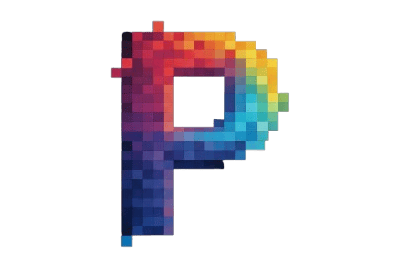

<h1 align="center">
  Hi There. I Am PixelBend

</h1>

  

# 💫 About
🤝 I’m looking for a place to fit in 
🌱 I’m currently learning Typescript, Svelete, React, Flutter, Go, Rust, Elixir and Python 
🧑‍💻 I like to build cool projects  

# 🃏 Dev Card

# 📊 GitHub Stats

